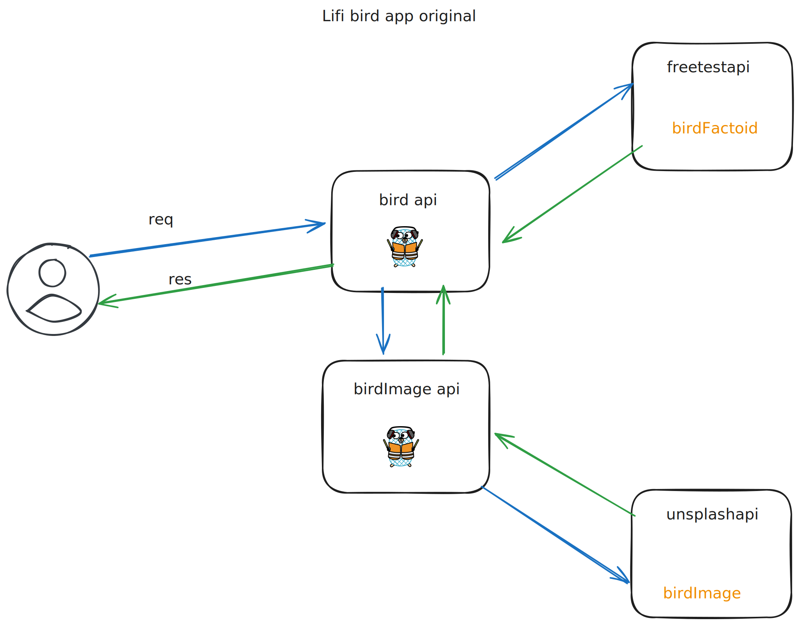

# Bird app

Awesome application that gives us birds.  
For Data Flow refer to the following sketch:  

## Running the app

### v0
In its original version the app can be ran with the command `go run main.go` in both of the api folders.  

### v0.1  
The app can now be run with docker, you can find the two Dockerfiles in the api folders.  
You can also pull the images from dockerhub using the following commands: `docker pull rdg5/birdapi` and `docker pull rdg5/birdimageapi`.  
The recommended way would be creating a separate network for the two containers, e.g.: `docker network create --driver bridge bird` and run the two containers using that network `docker run --name birdapi --network bird birdapi` and `docker run --name birdimageapi --network bird birdimageapi`.  
Should you want to test it in your browser, don't forget to expose the necessary ports using `-p 4201:4201` and `-p 4200:4200`.

### v1.0  

The app can be deployed to an AWS EC2 instance using Terraform as the Infrastructure as Code tool.  
All the necessary files can be found in the `infra/` folder.  
The required steps are [installing Terraform](https://developer.hashicorp.com/terraform/tutorials/aws-get-started/install-cli) and then creating your own version of the `terraform.tfvars` file, you can use the `example.terraform` file found in the `infra\` folder to see what variables you will need.  
To run simply initialize a new Terraform project using `terraform init` and then apply the configuration with `terraform apply`. The instance takes a little bit of time to install the necessary programs, but once its done, you can access the bird api on the `publicIP:4201`.

### v1.1  

The app can be run through kubernetes. For easier deploy apply the two deployments and the two services from the `kubernetes-manifests/` folder. The birdapi can be reached through the `localhost:30001` nodeport. Please note that the birdimageapi is running in ClusterIP mode, if you want to access the api externally, you need to change the `birdimageapi-service.yaml` type to NodePort.  

### v1.2

The app can be ran using helm charts.  
For easier deploy apply the two deployments and the two services from the `helm-charts/bird/` and `helm-charts/birdImage/` folders. The birdapi can be reached through the `localhost:30001` nodeport. Please note that the birdimageapi is running in ClusterIP mode, if you want to access the api externally, you need to change the `birdimageapi-service.yaml` type to NodePort.